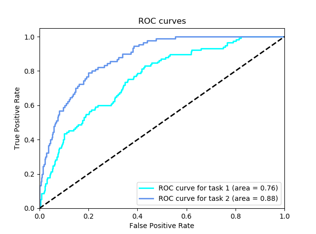
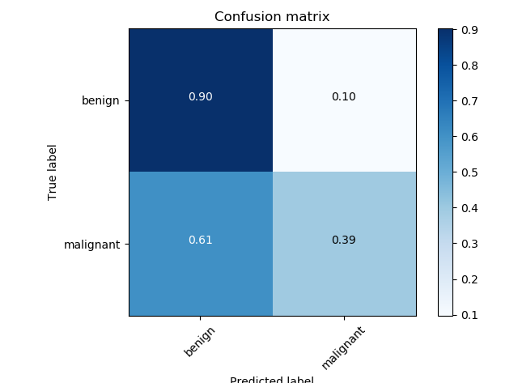

# Dermatologist AI mini project from Udacity
This mini project visually diagnoses melanoma, nevus and seborrheic keratosis, which is from [Udacity Deep Learning Nanodegree](https://www.udacity.com/course/deep-learning-nanodegree--nd101).  
Because of 'Memory Error' issue, I delete python objects from time to time in the notebook


## Missing files to run the notebook
This repository doesn't include data set for training because images don't belong to me, but the training data and objective are pulled from the [2017 ISIC Challenge on Skin Lesion Analysis Towards Melanoma Detection](https://challenge.kitware.com/#challenge/583f126bcad3a51cc66c8d9a).  
[https://isic-archive.com/#images](https://isic-archive.com/#images) 

## Network & Data
  * Transfer learning using Inception Resnet V2<br>
    I thought the features of pre-trained network will be much different from those of medical images, so I tested network without pre-train, but its result wasn't good. So I applied transfer learning.
  * No augmented images<br>
    Tried vertical and horizontal flip images, but didn't apply to the result experiment because it didn't seem to improve accuracy or reduce loss.
  * Image size<br>
    I used 384 x 256 for target loading image size. Original image sizes are various from 1022 x 767 to 4288 x 2848. I wanted to use 1022 x 767 to save detail of image, but couldn't run on my computer, so I tested and reduced to 384 x 256.
## Evaluation
### Score
```
Category 1 Score: 0.759
Category 2 Score: 0.877
Category 3 Score: 0.818
```
### ROC AUC

### Confusion Matrix

